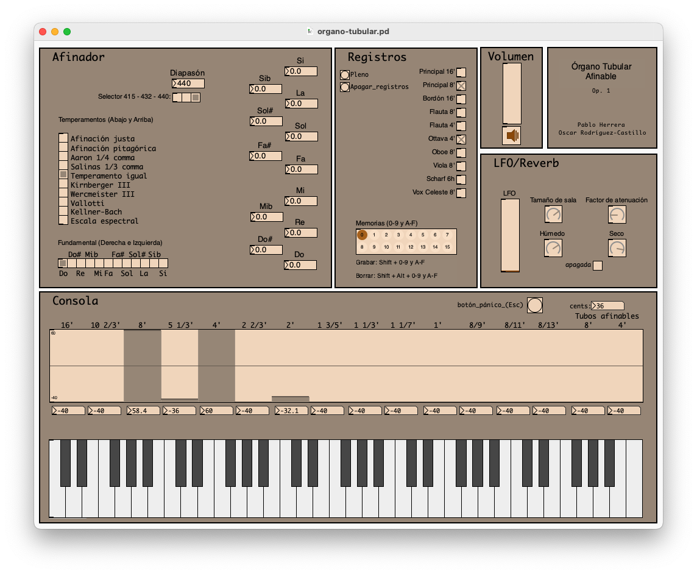
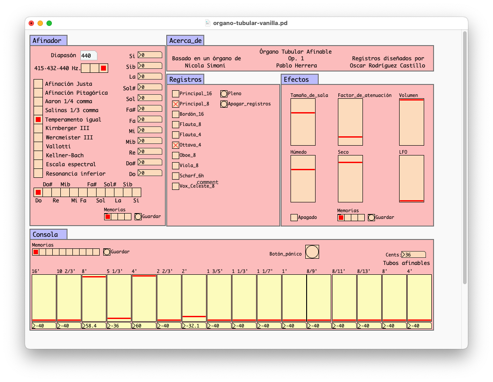

# Órgano Tubular Afinable

**Afinación y temperamentos históricoa** es un texto elaborado pro los profesores Pablo Herrera y Diego Vázquez, texto éste que aborda la temática de la historia de las afinaciones en la música atravesada por los conceptos de *lo aristoxénico* y *los pitagórico* como ordenadores de las diferentes soluciones que a lo largo de los siglos se ha dado al problema de la afinación musical.

**Órgano Tubular Afinable** es un *patch* para Pure Data, basado en **Pipe Organ** de *Nicola Simoni*, que no deja de ser una extensión del texto de Herrera y Vázquez, extensión absolutamente necesaria si realmente se desea acometer el estudio de las afinaciones, porque pretender comprender esta temática exclusivamente desde lo teórico sin incorporar la experiencia auditiva es como pretender aprender a cocinar sin comer.

## Instalación y ejecución
Aunque es perfectamente funcional enn Pure Data, recomendamos instalar **Purr Data** para la ejecución de **Órgano Tubular Temperado**, ya que esta variante de Pure Data responde mejor ante los controladores MIDI. Por lo demás, da igual Pure Data o Purr Data.

## Características
* 16 tubos, dos afinables, incluye armónicos 7, 9, 11, 13 (1 1/7', 8/9', 8/11', 8/13')
* 10 registros combinables, a saber:
	* Principal 16'
	* Principal 8'
	* Bordón 16'
	* Flauta 8'
	* Flauta 4'
	* Ottava 4'
	* Oboe 8'
	* Viola 8'
	* Scharf 6h
	* Vox Celeste 8'
* 16 memorias de los controles (versión CEAMMC).
* 4 memorias para el afinador, 4 memorias para la *reverb*, 10 memorias para la consola. (versión VANILLA).
* Polifonía de 8 teclas
* 11 temperamento, a saber:
	* Afinación justa
	* Afinación pitagórica
	* Aaron 1/4 comma
	* Salinas 1/3 comma
	* Temperamento igual
	* Kirnberger III
	* Wercmeister III
	* Vallotti
	* Kellner-Bach
	* Escala espectral
    * Resonancia inferior
* Diapasón afinable entre 400 y 460 hz., con afinación rápida en 415, 432 y 440. 
* Efectos:
	* Reverberación
	* Trémolo
* Control de volumen de salida.
* Controles MIDI programados para la superficie KORG NanoKontrol2.
* Botón de pánico (*panic*). El cambiar de afinación (por cualquier camino —modificando el diapasón, seleccionando un temperamento o afinando una nota en particular— mientras se está tocando una o más notas, producirá como efecto que dichas notas no se apaguen al soltar las teclas de la entrada MIDI. En esos caso, por favor, no entre en pánico y presione *panic*.